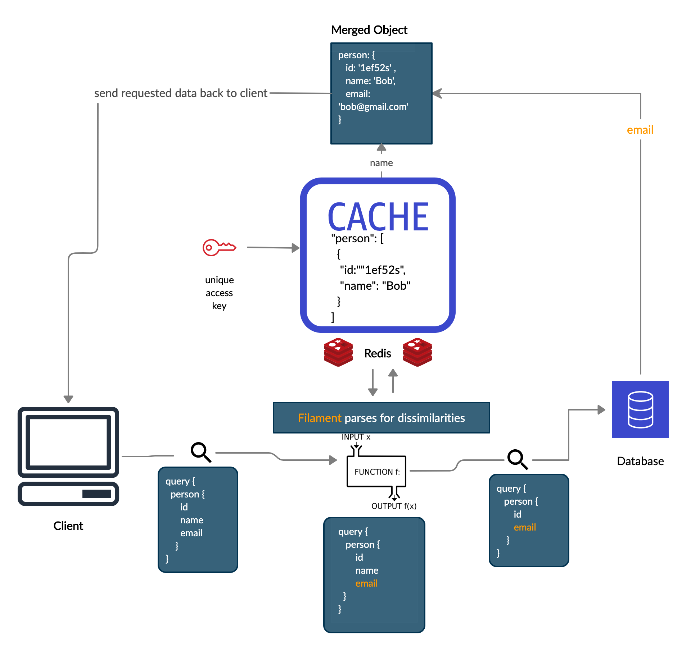
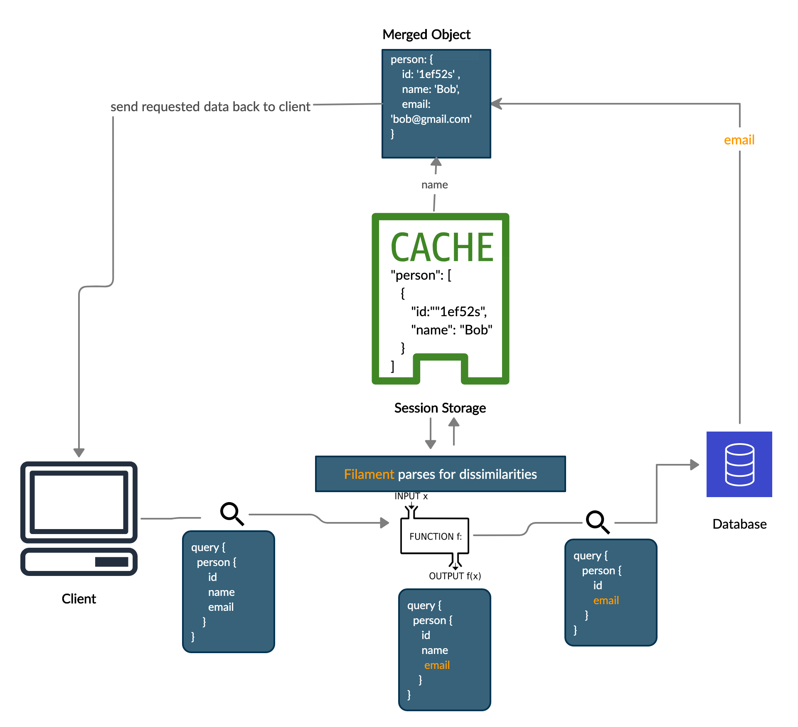
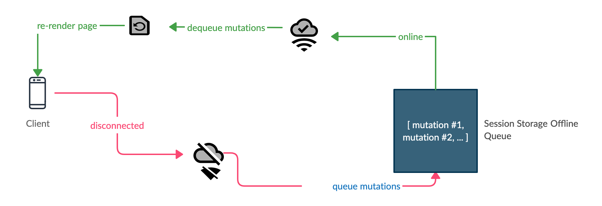

<p align="center"></p>

## FilamentQL

FilamentQL is a lightweight caching library for GraphQL queries that utilizes a parsing algorithm to detect differences between incoming queries and existing data stored within the cache. The library offers tools for both client and server side caching as well as tools for offline mode.
#### Server-Side Caching

On the server-side, FilamentQL provides a GraphQL endpoint for your Express server with user-defined type definitions and resolvers, and creates a caching layer via a local Redis instance. When a client makes a request, FilamentQL checks the Redis cache for any previously stored data that matches the request. Through a parsing algorithm, FilamentQL then takes the incoming query and identifies any dissimilarities, and makes a subsequent query for just those dissimilarities to the database. Whenever possible, FilamentQL merges data coming back from the database with data from Redis cache and sends it back to the client:

<p align="center"></p>


#### Client-Side Caching

On the client-side, FilamentQL behaves similarly. For its local cache implementation, FilamentQL utilizes session storage, a built-in property on the browser's window object, which allows data to persist throughout page refreshes.

<p align="center"></p>

### Offline Mode

FilamentQL also supports an offline mode. If the user gets disconnected from the server, all mutations made when the internet is down will be stored in a queue. At a set interval, FilamentQL checks if the network is back online. Whenever the user is back online, FilamentQL dequeues and sends each mutation to the server. Subsequently, the data that comes back from server will update the state and re-render the frontend components. What the user experiences and sees on their end is a seamless re-syncing of information when they come back online.

 <p align="center"></p>
 
### Contributors

Filament is an open-source NPM package created in collaboration with [OS Labs](https://github.com/oslabs-beta/) and developed by
- [Andrew Lovato](https://github.com/andrew-lovato)
- [Chan Choi](https://github.com/chanychoi93)
- [Duy Nguyen](https://github.com/bobdeei)
- [Nelson Wu](https://github.com/neljson)

An interactive demo and detail information can be found at [filamentql.io](http://filamentql.io/)

## Installation

### Redis

Filament utilizes Redis for its server-side caching. If Redis is not already installed on your machine:

- Install on Mac using Homebrew:
  - In the terminal, enter `brew install redis`
  - When installation completes, start a redis server by entering `redis-server`
  - By default redis server runs on `localhost:6379`
  - To check if your redis server is working: send a ping to the redis server by entering the command `redis-cli ping`, you will get a `PONG` in response if your redis server is working properly.
- Install on Linux or non-Homebrew:
  - Download appropriate version of Redis from [redis.io/download](http://redis.io/download)
  - Follow installation instructions
  - When installation completes, start a redis server by entering `redis-server`
  - By default redis server runs on `localhost:6379`
  - To check if your redis server is working: send a ping to the redis server by entering the command `redis-cli ping`, you will get a `PONG` in response if your redis server is working properly.

### Filament
`npm install filamentql`

## Instructions

Filament comes with `filamentql/client` and `filamentql/server` in order to make all the magic happen.

On client side, `filamentql` exposes 2 hooks:  
- `useFilamentQuery` 
  - helps query data from GraphQL server
- `useFilamentMutation` 
  - helps make mutation even though the network is offline

Both abstract away how to fetch queries and mutations and automatically update state when data is returned from server.

### Client Example

```JSX
import React, { useState } from 'react';
import { useFilamentQuery, useFilamentMutation } from 'filamentql/client';

const query = `
  query {
    todos {
      id
      text
      isCompleted
    }
  }
`;

const mutation = (text) => `
  mutation {
    addTodo(input: { text: "${text}" }) {
      id
      text
      isCompleted
    }
  }
`;

const App = () => {
  const [value, setValue] = useState('');
  const { state: todosQuery } = useFilamentQuery(query);
  const [callAddTodoMutation, addTodoResponse] = useFilamentMutation(
    mutation,
    () => {
      // this callback is invoked when data is returned from server
      // this is a good place to update relevant state now with new data
      console.log(addTodoResponse.addTodo);
    }
  );

  const handleSubmit = (event) => {
    event.preventDefault();
    callAddTodoMutation(value);
    setValue('')
  };

  const handleChange = (event) => setValue(event.target.value)

  return (
    <div className="App">
      <form onSubmit={handleSubmit}>
        <input type="text" value={value} onChange={handleChange} />
        <button type="submit">New todo</button>
      </form>
      <div>
        {todosQuery &&
          todosQuery.todos.map((todo) => <Todo key={todo.id} todo={todo} />)}
      </div>
    </div>
  );
};

export default App;
```

### Server Example

Filament achieves the caching ability via Express middleware `/filament`. Since `useFilamentQuery` utilize caching ability, the middleware `/filament` needs to be setup in order to facilitate caching process.

```js
const express = require('express');
const { graphqlHTTP } = require('express-graphql');
const redis = require('redis');

// Redis Setup
const client = redis.createClient();
client
  .on('error', (err) => console.log('Error: ' + err))
  .on('connect', () => console.log('Redis client connected'));

// Filament Setup
const filamentMiddlewareWrapper = require('filamentql/server');
const filamentMiddleware = filamentMiddlewareWrapper(client);

// Express setup
const app = express();
const PORT = 4000;
const schema = require('./schema');

app.use(express.json());
app.use('/filament', filamentMiddleware);
app.use(
  '/graphql',
  graphqlHTTP((req) => ({
    schema,
    graphiql: true,
    context: {
      req,
    },
  }))
);

app.listen(PORT, () => console.log(`GraphQL server is on port: ${PORT}`));
```

### Notes

- Currently, Filament v1.0 can only cache and parse queries without arguments, variables, or directives
